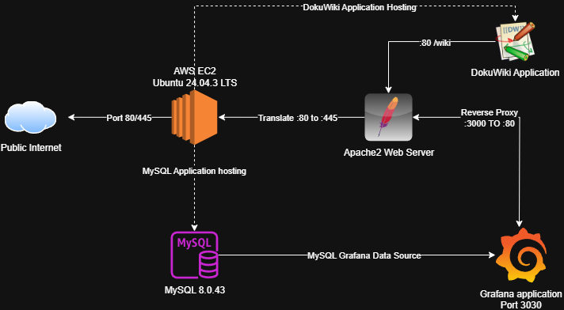
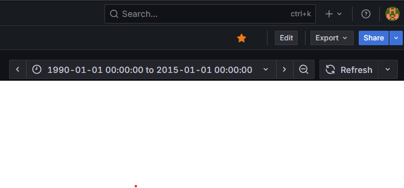
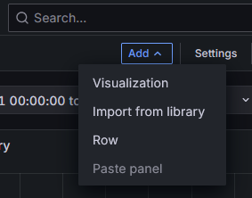

# Food Security Dashboard
This repository stores configuration items & documentation for the Food Security dashboard.

Details to set up the user profile can be found here:
[Setup Guide](./UserSetup.md)

## Architecture



## Prerequisites

- AWS account with billing access.
- Basic Linux and SQL familiarity.
- A workstation with SSH and Git.
- Datasets for selected region(s).

### Security Considerations

- Enabled MFA on all human users on the AWS account.
- Utilise principle of least privilege.
- Decide what data may contain sensitive attributes, avoid ingesting PII that is not needed for food security analysis.

## AWS Account Setup

Note that this section will be entirely based on your resources and budget.

### Billing Guardrails

- You can enable alerts via Cost Budgets with email alerts at 50, 80 and 100 percent of your monthly cap.
- AWS Cost Explorer can assist you in finding where any abnormal costs may be coming from.

### Identity and Access

- Create an Administrator role for setup tasks and a Developer role with limited permissions for day-to-day tasks.

### Network and Compute

- Use the default VPC for a quick start, or create a minimal VPC with 1 public subnet.
- Launch an EC2 Ubuntu 24.04 t3.medium with an 80gb drive or similar to host MySQL and Grafana.
- Allocate an Elastic IP.

#### Security Group (SG)

- Inbound: Port 22 from your IP, 3000 Grafana from your IP, 3306 MySQL from 127.0.0.1 only.
- Outbound: Allow all for package updates and API calls.

## Email Alerts

Use an email hosting provider or your own infrastructure to facilitate sending emails. You can view instructions in the Grafana setup section on configuring the config file.

### Security Considerations

- AWS CloudTrail, GuardDuty and Config allow logging and monitoring for the AWS account and services. If you have the budget, it is recommended to enable these.
- Use roles rather than long-lived access keys.
- Keep ports closed by default and open them only to specific source IPs.
- Perform system updates regularly, and test them before deployment to ensure everything is still operational.

## Provision the Instance

- SSH to the instance, then:

```bash
# Update packages
sudo apt update && sudo apt -y upgrade

# Install utilities
sudo apt -y install jq unzip ufw

# Basic firewall
sudo ufw allow OpenSSH
sudo ufw allow 3000/tcp   # Grafana UI
sudo ufw enable
```

## Install and Secure MySQL

For our project, we utilised MySQL version 8.0.42.

### Installation

```bash
# Install MySQL Server
sudo apt -y install mysql-server

# Secure base install
sudo mysql_secure_installation
# - Set strong root password
# - Remove anonymous users
# - Disallow remote root login
# - Remove test database
```

### Bind and Users

```bash
# Bind to localhost only
sudo sed -i 's/^bind-address.*/bind-address = 127.0.0.1/' /etc/mysql/mysql.conf.d/mysqld.cnf
sudo systemctl restart mysql
# The above bind-address in MySQL’s server config so it listens only on the loopback interface 127.0.0.1, then restarts 
# MySQL to apply the change.

# Create DB and users
sudo mysql <<'SQL'
```

```sql
-- Create database for indicators
CREATE DATABASE fsdb CHARACTER SET utf8mb4;
-- Creates a dedicated database for your indicators and observations using utf8mb4.
-- utfmb4 ensures correct storage of multilingual text, place names and provider notes.

-- App user with least privilege
CREATE USER 'fsapp'@'localhost' IDENTIFIED BY 'REPLACE_ME_STRONG';
-- Creates an application account that can only connect from the local host.

-- Grant minimal rights
GRANT SELECT, INSERT, UPDATE, DELETE ON fsdb.* TO 'fsapp'@'localhost';
-- Gives the app only data-manipulation rights on fsdb and nothing else. No schema changes, no user management, no file privileges.

FLUSH PRIVILEGES;
-- Ensures MySQL reloads the updated grant tables immediately.
```

### Schema

Schemas utilised in this project can be found here: <https://ecufoodsecurity.com/dokuwiki/doku.php?id=databaseschema>.

### Security Considerations

- Always use strong passwords.
- Restrict MySQL to localhost when Grafana runs on the same host.
- For remote access, prefer TLS on a private network only.

## Grafana Details
Grafana setup details are as follows:
```
sudo apt-get install -y apt-transport-https software-properties-common wget
wget -q -O - https://apt.grafana.com/gpg.key | gpg --dearmor | sudo tee /etc/apt/keyrings/grafana.gpg > /dev/null
echo "deb [signed-by=/etc/apt/keyrings/grafana.gpg] https://apt.grafana.com stable main" | sudo tee -a /etc/apt/sources.list.d/grafana.list
sudo apt-get update
sudo apt-get install grafana
sudo systemctl status grafana-server
sudo systemctl daemon-reload
sudo systemctl daemon-reload
sudo systemctl start grafana-server
sudo systemctl status grafana-server
sudo systemctl edit grafana-server.service
```
### Configuring SMTP for Grafana
*Note: [instructions from Grafana website directly](https://grafana.com/docs/grafana/latest/alerting/configure-notifications/manage-contact-points/integrations/configure-email/)*

1. Access **config file** for Grafana.
2. Open **config file** using a text editor.
3. Locate the **SMTP settings** section.
4. Specify the following **parameters**:\
  i. *enabled* = true\
  ii. *host* = your-host:25\
  iii. *user* = your-SMTP-username (if authentication is required for SMTP.)\
  iv. *password* = your-SMTP-password (if authentication is required for SMTP.)\
  v. *from_address* = the-email-address-emails-will-come-from\
  vi. *from_name* = the-name-the-email-will-appear-from\
  vii. *skip_verify* = true (it is **highly** recommended to turn this off after testing.)
5. **Save and close** the config file
6. **Restart** Grafana

### Accessing Grafana

- Grafana can be accessed at http://your-ip:3000 by default.
- The admin password should be updated immediately.

### Connect Grafana and MySQL

In Grafana, go to Connections -> Add data source -> MySQL

- **Host**: 127.0.0.1:3306
- **Database**: your-db-name (we used fsbd earlier in this documentation)
- **User**: your-db-user (we used fsapp earlier in this documentation)
- **TLS**: skip on localhost only. Use TLS if remote.

### Data Ingestion

Data ingestion methods via the API can be found at the link below.

<https://ecufoodsecurity.com/dokuwiki/doku.php?id=apiload>

### Scheduling

WIP; Detail cron jobs or systemd timers here.

### Security Considerations

- Disable anonymous access in Grafana (Administration -> Users).

### MySQL Ver 8.0.42
MySQL has been installed on the Ubuntu server, ready to be connected to Grafana.

So far, only the root user has access. The database can be connected to by running the following commands:
```
$> sudo su
$> mysql -u root
```

I've created a database called grafana_data, and some tables to store mock data. 
The mock data is from a food security dataset on kaggle, I'll use it to populate the following tables:
pesticides
rainfall


```
mysql> CREATE DATABASE grafana_data;
mysql> USE grafana_data;
mysql> CREATE TABLE pesticides (
    Area VARCHAR(100),
    Element VARCHAR(100),
    Item VARCHAR(100),
    Year YEAR,
    Unit VARCHAR(100),
    Value INT
);

mysql> CREATE TABLE yield(
    AreaCode INT,
    Area VARCHAR(100),
    ElementCode INT,
    Element VARCHAR(100),
    ItemCode INT,
    Item VARCHAR(100),
    Year YEAR,
    Unit VARCHAR(100),
    Value INT
);
mysql> INSERT INTO pesticides VALUES("Albania", "Use", "Pesticides (Total)", "1998", "tonnes of active ingredients", "439.89");

CREATE USER 'user'@'localhost' IDENTIFIED BY '****';
GRANT INSERT, UPDATE, DELETE ON grafana_data.pesticides TO 'user'@'localhost';

CREATE USER 'grafana_read'@'localhost' IDENTIFIED BY '****';

```

---

### Making Grafana Widgets
I've created a test Dashboard on Grafana called Food Security Statistics.
If you open that, I've created two widgets, one is the avg of tons of pesticides across all countries per year, the other is a time series of each country/how much pesticides they use/year.


The backend SQL statement for the average of tons per year is:
```
SELECT
  AVG(Value)
FROM
  grafana_data.pesticides
GROUP BY
  Year
LIMIT
  50
```

The backend SQL statement for the time series is:
```
SELECT
  STR_TO_DATE(CONCAT(Year, '-01-01'), '%Y-%m-%d') AS time,
  Area AS country,
  Value AS pesticide_value
FROM
  grafana_data.pesticides
ORDER BY
  time ASC;
```


More instructions on how to access:
1. Open the dashboards tab on the Grafana dashboard

2. Edit the dashboard

3. Add the Visualization Widget

4. Edit the widget using the builder mode

5. Edit the widget using the SQL Builder mode


